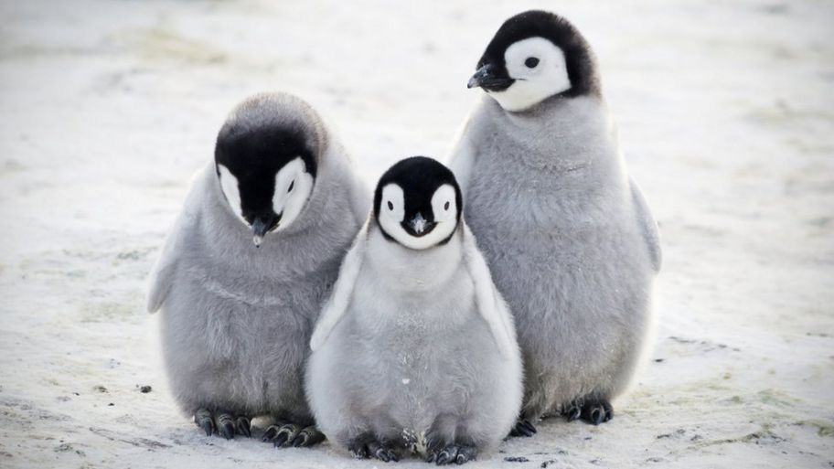

---
# Display name
title: Yuchen Jiang
secondary: 姜昱辰

# Username (this should match the folder name)
authors:
- martina

# Is this the primary user of the site?
superuser: false

# Role/position
role: PhD Student

# Organizations/Affiliations
organizations:
- name: ETH Zürich
  url: "https://inf.ethz.ch"

# Short bio (displayed in user profile at end of posts)
bio: 

interests:
- Natural Language Generation
- NLP for long texts
- Coreference Resolution
- Machine Translation
- Discourse & Text Coherence

# Social/Academic Networking
# For available icons, see: https://sourcethemes.com/academic/docs/widgets/#icons
#   For an email link, use "fas" icon pack, "envelope" icon, and a link in the
#   form "mailto:your-email@example.com" or "#contact" for contact widget.
social:
- icon: envelope
  icon_pack: fas
  link: "mailto:eleanorjiang630@gmail.com"  # For a direct email link, use "mailto:test@example.org".
- icon: github
  icon_pack: fab
  link: https://github.com/EleanorJiang
- icon: google
  icon_pack: fab
  link: https://scholar.google.com/citations?user=AEiEn6MAAAAJ 
- icon: twitter
  icon_pack: fab
  link: https://twitter.com/eleanorjiang630
- icon: portrait
  icon_pack: fas
  link: elejiang.me

# Enter email to display Gravatar (if Gravatar enabled in Config)
email: ""
  
# Organizational groups that you belong to (for People widget)
#   Set this to `[]` or comment out if you are not using People widget.  
user_groups:
- Members
- Teaching Assistants AFLT
---

Eleanor is a second-year Ph.D. in the Institute of Machine Learning at ETH Zürich, where she is supervised by Ryan Cotterell and [Mrinmaya Sachan](https://sites.google.com/site/mrinsachan/). She also obtained her Master’s in Computer Science at ETH Zürich. Previously, she did her undergraduate studies at Zhejiang University and also spent some time at UCLA, supervised by Kai-Wei Chang. Her research is focused on generating and understanding long texts. To this end, she has recently been dabbling into document-level machine translation, coreference resolution, and coherence modeling. She also likes fun applications of natural language generation (news generation, lyrics generation, etc.). ​In her spare time, Eleanor enjoys learning languages, skiing and hiking. She also plays the piano. It is her greatest dream to travel to all 195 countries in the world. 

Native Language: Mandarin

Animal Form: Penguin

